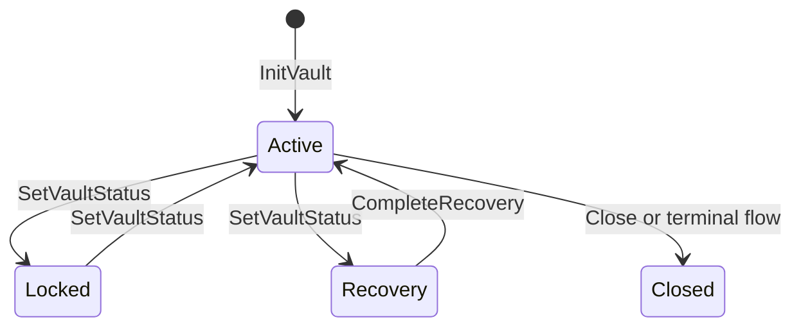
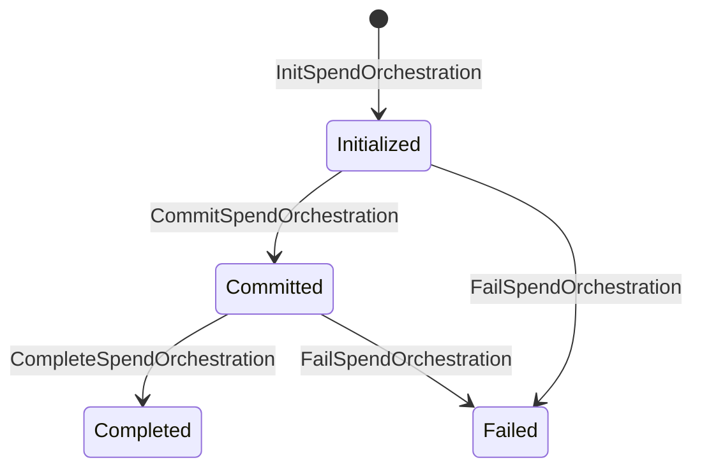

The on-chain program is implemented under `programs/vaulkyrie-core/src/`. This page describes the existing code and avoids proposing instruction layout changes.

## Account model

| Account | Source struct | Purpose |
| --- | --- | --- |
| Vault Registry | `VaultRegistry` in `state.rs` | Stores wallet public key, authority hash, threshold, participant count, status, sequence, and bump. |
| Quantum Authority | `QuantumAuthorityState` in `state.rs` | Stores current post-quantum authority hash/root, sequence, and bump. |
| Authority Proof | `AuthorityProofState` in `state.rs` | Stages large authority proofs in chunks before final authority rotation. |
| Spend Orchestration | `SpendOrchestrationState` in `state.rs` | Tracks a spend action hash, signer commitments, signing package hash, transaction binding, expiry, and status. |
| Recovery State | `RecoveryState` in `state.rs` | Tracks recovery commitment, target threshold/participant count, expiry, and status. |
| PQC Wallet | `PqcWalletState` in `state.rs` | Stores a stable wallet id, current Winternitz root, sequence, and bump. |

## Instruction groups

The instruction parser is in `programs/vaulkyrie-core/src/instruction.rs`. The Rust SDK builder names map directly to these instruction groups.

| Group | Instructions |
| --- | --- |
| Health | `Ping` |
| Vault lifecycle | `InitVault`, `SetVaultStatus` |
| Authority | `InitAuthority`, `RotateAuthority`, `InitAuthorityProof`, `WriteAuthorityProofChunk`, `RotateAuthorityStaged`, `AdvanceWinterAuthority`, `MigrateAuthority` |
| Quantum vault | `InitQuantumVault`, `SplitQuantumVault`, `CloseQuantumVault` |
| PQC wallet | `InitPqcWallet`, `AdvancePqcWallet` |
| Spend orchestration | `InitSpendOrchestration`, `CommitSpendOrchestration`, `CompleteSpendOrchestration`, `FailSpendOrchestration` |
| Recovery | `InitRecovery`, `CompleteRecovery` |

## State transitions

`programs/vaulkyrie-core/src/transition.rs` holds pure transition logic. The processor handlers in `processor.rs` deserialize instruction data, verify PDAs and signers, then call transition helpers.

Spend orchestration is separate from vault status:

## PDA seeds

The PDA helpers are mirrored in `programs/vaulkyrie-core/src/pda.rs`, `crates/vaulkyrie-sdk/src/pda.rs`, and `src/sdk/pda.ts`.

| PDA | Seed shape |
| --- | --- |
| Vault Registry | `vault_registry`, wallet pubkey |
| Quantum Authority | `quantum_authority`, vault id |
| Authority Proof | `authority_proof`, vault id, statement digest |
| Quantum Vault | `quantum_vault`, hash |
| PQC Wallet | `pqc_wallet`, wallet id |
| Spend Orchestration | `spend_orch`, vault id, action hash |

## Why staged proofs exist

Authority rotation proofs can exceed a comfortable single-instruction payload. The program has an `AuthorityProofState` plus chunk-writing instructions so the client can stage proof bytes, bind them to a statement digest and commitment, then complete rotation from staged data.

This is reflected in:

- `InitAuthorityProof`
- `WriteAuthorityProofChunk`
- `RotateAuthorityStaged`
- `AUTHORITY_PROOF_CHUNK_MAX_BYTES` in `crates/vaulkyrie-protocol/src/lib.rs`

