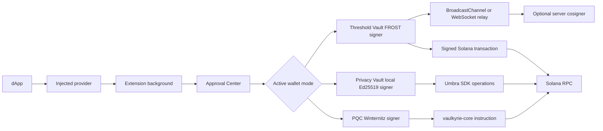

Vaulkyrie separates user interaction, cryptographic ceremonies, and on-chain state transitions.

The browser extension owns the user session and approval flow. The relay server only coordinates ceremony messages and optional server cosigner participation. The Rust workspace owns protocol layouts, instruction builders, CLI tooling, and the Solana program state machine.

## Runtime layers

## Browser extension path

The extension has four major runtimes:

- `src/injected/index.ts`: injects the browser wallet provider into pages.
- `src/content/index.ts`: bridges page messages into the extension.
- `src/background/index.ts`: handles persistent background actions, internal RPC, signing, secret access, and session state.
- `src/App.tsx` plus `src/components/`: renders the wallet UI and approval screens.

The approval path is centered around `src/components/extension/ApprovalCenter.tsx`, `src/extension/messages.ts`, `src/extension/approvalStorage.ts`, and signing helpers in `src/services/frost/signTransaction.ts`.

## Ceremony path

Threshold ceremonies use one of two relay adapters:

| Relay | Source | Use |
| --- | --- | --- |
| BroadcastChannel | `src/services/relay/channelRelay.ts` | Same-origin browser tabs, local testing, and demo flows. |
| WebSocket | `src/services/relay/websocketRelay.ts` and `relay-server/src/server.ts` | Cross-device ceremonies and server cosigner sessions. |

The DKG and signing orchestrators live in:

- `src/services/frost/dkgOrchestrator.ts`
- `src/services/frost/signingOrchestrator.ts`
- `src/services/frost/frostService.ts`
- `crates/vaulkyrie-frost-wasm/src/lib.rs`

## Relay server path

The relay server exposes:

- WebSocket session creation, join, participant assignment, and room message forwarding in `relay-server/src/server.ts`.
- Session auth tokens and invite validation in `src/services/relay/sessionInvite.ts` and server join handling.
- Server cosigner registration and signing in `relay-server/src/cosigner.ts`.
- Encrypted server-local state in `relay-server/src/secureStorage.ts`.
- PQC wallet sponsorship helpers in `relay-server/src/pqcSponsor.ts`.

The relay does not need to learn all FROST shares. In the normal WebSocket room flow it forwards round messages. If a server cosigner is registered, it holds only its own key package and signs as one participant.

## On-chain path

The Rust workspace defines the on-chain protocol:

- Account state: `programs/vaulkyrie-core/src/state.rs`
- Instruction parsing: `programs/vaulkyrie-core/src/instruction.rs`
- Transition validation: `programs/vaulkyrie-core/src/transition.rs`
- Processor handlers: `programs/vaulkyrie-core/src/processor.rs`
- PDA derivation and verification: `programs/vaulkyrie-core/src/pda.rs`
- Shared constants and message builders: `crates/vaulkyrie-protocol/src/lib.rs`

The Rust SDK mirrors those layouts for clients in `crates/vaulkyrie-sdk/src/instruction.rs`, `crates/vaulkyrie-sdk/src/accounts.rs`, and `crates/vaulkyrie-sdk/src/pda.rs`.

