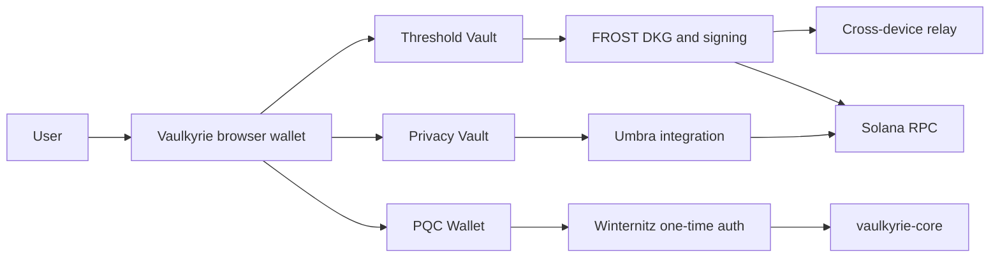

Vaulkyrie is a Solana wallet suite for users and builders who want more than a single local private key. The suite brings together a browser wallet, cross-device signing coordination, FROST threshold custody, Privacy Vault flows powered by Umbra, and a post-quantum-oriented PQC Wallet path based on Winternitz one-time authorization.

<Warning>
Vaulkyrie is early-stage software. The code has not completed a formal third-party audit, the SDK and CLI are being prepared for public distribution, and this documentation should be treated as initial technical documentation for testing and review. Do not use Vaulkyrie for production custody or high-value funds yet.
</Warning>

<CardGroup cols={3}>
  <Card title="Threshold Vault" icon="users" href="/wallet-modes/threshold-vault">
    Split signing authority across participants with FROST DKG and threshold Ed25519 signatures.
  </Card>
  <Card title="PQC Wallet" icon="atom" href="/wallet-modes/pqc-wallet">
    Use a Winternitz one-time authorization path that advances to a fresh root after each PQC spend.
  </Card>
  <Card title="Privacy Vault" icon="shield" href="/wallet-modes/privacy-vault">
    Access private transfer workflows through Vaulkyrie's Umbra integration.
  </Card>
</CardGroup>

## What Vaulkyrie offers

Vaulkyrie is designed as a wallet suite rather than a single wallet mode.

| Option | Who it is for | What it does |
| --- | --- | --- |
| Threshold Vault | Teams, shared treasuries, advanced self-custody users | Requires a threshold set of participants to cooperate before a Solana transaction can be signed. |
| PQC Wallet | Users testing hash-based authorization models | Uses one-time Winternitz signing material and rotates to the next root after each spend. |
| Privacy Vault | Users testing private transfer workflows | Connects Vaulkyrie wallet flows to Umbra-powered private transfer operations. |
| Relay Server | Multi-device users and operators | Coordinates cross-device DKG/signing sessions and optional server cosigner support. |
| SDK and CLI | Developers | Provide instruction builders, PDA helpers, account decoding, DKG harnesses, and integration tooling. |

## Official links

<CardGroup cols={3}>
  <Card title="Main website" icon="globe" href="https://www.vaulkyrie.xyz/">
    The public Vaulkyrie website and landing page.
  </Card>
  <Card title="GitHub organization" icon="github" href="https://github.com/Vaulkyrie">
    The destination organization for Vaulkyrie repositories.
  </Card>
  <Card title="X / Twitter" icon="twitter" href="https://x.com/vaulkyrie_hq">
    Official Vaulkyrie updates.
  </Card>
</CardGroup>

## System overview

## Current code-sourced status

| Surface | Current state |
| --- | --- |
| Browser wallet | Implemented as a Vite React browser extension in `src/`. It includes onboarding, approval UI, threshold signing, PQC wallet UI, Privacy Vault UI, and internal wallet SDK code. |
| Relay server | Implemented in `relay-server/src/`. It supports WebSocket ceremony relay, session invites, server cosigner registration/signing, and PQC sponsorship helpers. |
| Rust SDK | Implemented in `crates/vaulkyrie-sdk/`. It includes instruction builders, PDA helpers, account decoders, error decoding, and optional FROST helpers. |
| CLI | Implemented in `crates/vaulkyrie-cli/`. It is usable from the workspace for DKG harnesses, instruction JSON, PDA derivation, decoding, and inspection. |
| TypeScript SDK | Now being prepared as a package from browser SDK code. Until it is published, local workspace/package-link usage is the intended path. |

## Where to start

- Read the [codebase map](/overview/codebase-map) to understand the moving parts.
- Read [Threshold Vault](/wallet-modes/threshold-vault), [PQC Wallet](/wallet-modes/pqc-wallet), and [Privacy Vault](/wallet-modes/privacy-vault) to choose a wallet mode.
- Read [Rust SDK and CLI](/reference/rust-sdk-cli) and [TypeScript SDK](/reference/typescript-sdk) before building an integration.
- Read [Readiness](/reference/readiness) before testing with real infrastructure.
