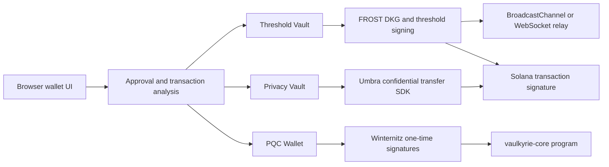

Vaulkyrie is an experimental Solana wallet system built around a simple idea: a wallet should not be locked to one custody model. The codebase currently supports three wallet modes that share the same browser wallet shell but use different signing and authorization paths.

<CardGroup cols={3}>
  <Card title="Threshold Vault" icon="users" href="/wallet-modes/threshold-vault">
    A FROST-based MPC wallet where signing authority is split across participants instead of held as one private key.
  </Card>
  <Card title="PQC Wallet" icon="atom" href="/wallet-modes/pqc-wallet">
    A Winternitz one-time signature wallet path for post-quantum-oriented spend authorization.
  </Card>
  <Card title="Privacy Vault" icon="eye-off" href="/wallet-modes/privacy-vault">
    A privacy-focused mode that integrates Umbra for confidential balances, private sends, and claimable UTXOs.
  </Card>
</CardGroup>

## What Vaulkyrie is

Vaulkyrie is a browser extension wallet plus a supporting Rust workspace and relay server.

The browser app is the user-facing wallet. It handles onboarding, account state, DKG ceremonies, FROST signing, Privacy Vault signing, PQC key storage, transaction approval, and Umbra operations. The Rust workspace holds the on-chain program, protocol constants, FROST harnesses, Rust SDK, WASM bindings, and CLI. The relay server coordinates cross-device threshold ceremonies and can hold a server cosigner share when configured.

Vaulkyrie is not a single monolithic wallet. It is closer to a custody lab with three user-facing signing modes:

- Threshold custody: the wallet public key is controlled by a threshold Ed25519 key generated through DKG.
- Post-quantum-oriented custody: each PQC spend consumes a one-time Winternitz signing root and advances to the next root.
- Private transfers: a Privacy Vault uses Umbra SDK flows for confidential registration, encrypted balances, deposits, withdrawals, private sends, scanning, and claims.

## What makes it different

Most wallets expose one signing primitive: a local Ed25519 keypair. Vaulkyrie separates the wallet experience from the signing primitive.

## Current code-sourced status

This documentation reflects the code as it exists now, not older project notes.

| Surface | Current state |
| --- | --- |
| Browser wallet | Implemented as a Vite React extension in `src/`. It includes onboarding, approval UI, threshold signing, PQC wallet UI, Privacy Vault UI, and an internal TypeScript SDK. |
| Relay server | Implemented in `relay-server/src/`. It exposes WebSocket ceremony relay, HTTP health/status endpoints, server cosigner registration, cosigner signing, and PQC wallet sponsorship helpers. |
| Rust SDK | Implemented in `crates/vaulkyrie-sdk/`. It includes instruction builders, PDA helpers, account decoders, error decoding, and optional FROST helpers. |
| CLI | Implemented in `crates/vaulkyrie-cli/`. It is usable from the workspace and emits instruction JSON for vault, authority, PQC, spend, recovery, PDA, decode, inspect, and DKG flows. |
| TypeScript SDK | Present under `src/sdk/`, but currently internal to the browser wallet and not packaged as a standalone public SDK. |

<Warning>
The Solana program source is treated as deployment-sensitive. The docs describe it, but this pass does not change program behavior or instruction layouts.
</Warning>

## Source boundaries

Project-specific claims in these docs come from the active source trees:

- Browser extension and relay server: `src/` and `relay-server/src/`
- Rust workspace: `crates/` and `programs/vaulkyrie-core/src/`

Protocol background uses primary or protocol-owned references only where useful:

- FROST: RFC 9591
- Umbra: Umbra SDK, indexer, and relayer documentation
- Winternitz/PQC context: Vaulkyrie source and Blueshift Labs inspiration material
