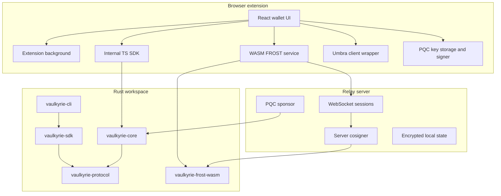

Vaulkyrie is split across two active repositories: the browser wallet repository and the Rust workspace repository. This page uses repository-relative paths only.

## Repository surfaces

| Area | Source path | Responsibility |
| --- | --- | --- |
| Browser extension shell | `src/App.tsx`, `src/main.tsx`, `src/background/index.ts`, `src/content/index.ts`, `src/injected/index.ts` | Extension UI, background runtime, page injection, provider bridge, approval routing. |
| Wallet state and backup | `src/store/walletStore.ts`, `src/lib/walletPersistStorage.ts`, `src/lib/walletBackup.ts`, `src/background/sessionState.ts` | Account persistence, encrypted backups, session unlock state, wallet password checks. |
| Threshold signing | `src/services/frost/` | WASM-backed FROST DKG, signing rounds, local signing, multi-device orchestration, cosigner signing. |
| Ceremony relay client | `src/services/relay/` | BroadcastChannel relay for same-browser testing and WebSocket relay for cross-device ceremonies. |
| Relay server | `relay-server/src/server.ts`, `relay-server/src/cosigner.ts`, `relay-server/src/secureStorage.ts`, `relay-server/src/pqcSponsor.ts` | WebSocket rooms, session invite auth, server cosigner share storage/signing, PQC sponsorship. |
| PQC wallet | `src/services/quantum/`, `src/pages/QuantumVault.tsx`, `src/background/quantumVaultSession.ts` | Winternitz key generation, encrypted local one-time key storage, PQC wallet creation, advance signing. |
| Privacy Vault | `src/services/umbra/`, `src/components/wallet/PrivacyView.tsx`, `src/components/onboarding/PrivacyVaultSetup.tsx` | Umbra client setup, master seed storage, private sends, deposits, withdrawals, scan, claim, Privacy Vault onboarding. |
| Internal TypeScript SDK | `src/sdk/` | Browser-side instruction builders, account decoders, PDA helpers, errors, and client helpers. |
| Rust protocol constants | `crates/vaulkyrie-protocol/src/lib.rs` | Shared action descriptors, thresholds, WOTS constants, message domains, and digest builders. |
| Rust SDK | `crates/vaulkyrie-sdk/src/` | Instruction builders, PDA derivation, account decoding, error decoding, optional FROST helpers. |
| CLI | `crates/vaulkyrie-cli/src/` | Workspace CLI command groups for DKG, vaults, authority, PQC, spend orchestration, recovery, PDA, inspect, decode, and ping. |
| Solana program | `programs/vaulkyrie-core/src/` | On-chain account state, instruction parser, transition rules, PDA verification, processor handlers. |

## System topology

## Build boundaries

The browser app is a private Vite React project. The relay server is a private Node.js package. The Rust workspace is a Cargo workspace with separate crates for protocol primitives, SDK, CLI, FROST harnesses, WASM exports, and the on-chain program.

The TypeScript SDK currently lives inside the browser app. That means application developers should treat it as internal until a standalone package is extracted with its own package manifest, build output, tests, and published import surface.

