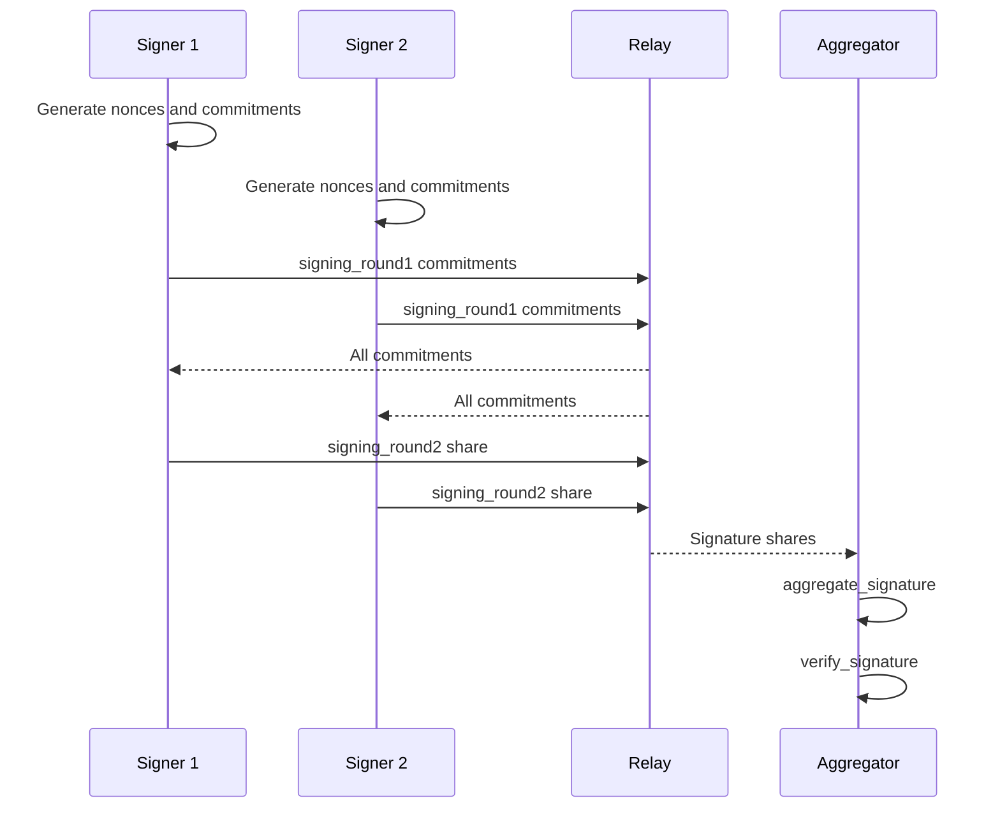

FROST stands for Flexible Round-Optimized Schnorr Threshold signatures. RFC 9591 specifies a two-round threshold signing protocol for Schnorr signatures and defines how participants generate nonces, commitments, signature shares, and an aggregate signature.

Vaulkyrie uses the Rust `frost-ed25519` implementation through:

- `crates/vaulkyrie-frost/src/lib.rs`
- `crates/vaulkyrie-frost-wasm/src/lib.rs`
- `src/services/frost/frostService.ts`

## Why FROST fits Solana

Solana accounts use Ed25519 signatures. FROST can produce a standard Ed25519-compatible signature from threshold shares. That means downstream Solana transaction validation sees a normal signature even though no single participant held the full private key.

## Vaulkyrie DKG mapping

The WASM module exports DKG round functions:

| WASM export | Browser wrapper | Output |
| --- | --- | --- |
| `dkg_round1` | `dkgRound1` | Secret package and broadcast package. |
| `dkg_round2` | `dkgRound2` | Updated secret package and peer-addressed packages. |
| `dkg_round3` | `dkgRound3` | Key package, public key package, group public key. |

The browser wrapper serializes FROST structures as JSON-compatible byte arrays so they can be passed between WASM and browser relay transports.

## Vaulkyrie signing mapping

| WASM export | Browser wrapper | Purpose |
| --- | --- | --- |
| `signing_round1` | `signingRound1` | Generate nonces and commitments. |
| `signing_round2` | `signingRound2` | Produce one participant signature share. |
| `aggregate_signature` | `aggregateSignature` | Combine shares into final signature. |
| `verify_signature` | `verifySignature` | Verify the aggregate signature against the group key. |

## Signing sequence

## Local vs multi-device signing

`signLocal` in `src/services/frost/frostService.ts` is a convenience path for signing with enough key packages on one device. It is useful for testing and for accounts whose threshold packages are locally present.

Multi-device signing uses `SigningOrchestrator` in `src/services/frost/signingOrchestrator.ts`. It waits for commitments and signature shares from the relay before aggregating.

## Server cosigner integration

The server cosigner path uses the same FROST rounds, but one participant is automated by `relay-server/src/cosigner.ts`. The cosigner:

1. Loads its stored key package.
2. Joins a relay session from an invite.
3. Emits signing commitments when it receives a sign request.
4. Waits for enough commitments.
5. Sends its signature share.

It never needs all shares.

## Primary reference

- RFC 9591: https://www.rfc-editor.org/rfc/rfc9591

