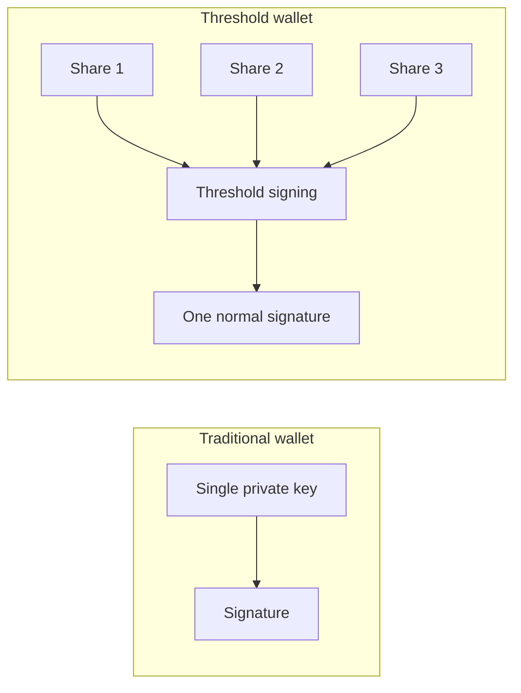
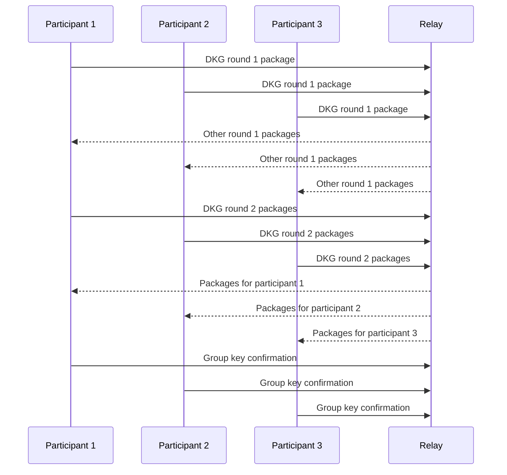

MPC means multiple parties compute a result together without one party learning all private inputs. TSS, or threshold signature schemes, apply that idea to digital signatures: a group of participants collectively produces one valid signature when enough participants cooperate.

In a wallet, the goal is simple: no single machine should need to hold the full signing key.

## Traditional wallet vs threshold wallet

A Solana validator or dApp does not need to know that threshold signing happened. It only sees a valid Ed25519 signature for the wallet public key.

## DKG

DKG means distributed key generation. It is the ceremony that creates key shares without a trusted dealer. Instead of one party creating a private key and splitting it, all participants contribute randomness and end with:

- A participant-specific secret key package.
- A shared public key package.
- A group public key that verifies final signatures.

In Vaulkyrie, DKG is implemented through the WASM FROST exports in `crates/vaulkyrie-frost-wasm/src/lib.rs` and wrapped by `src/services/frost/frostService.ts`.

## Why threshold matters

For a 2-of-3 vault:

- One lost participant can be tolerated.
- One compromised participant cannot sign alone.
- Any two valid participants can sign.
- A server cosigner can be one participant, but it should not reduce the effective security threshold.

## Vaulkyrie ceremony data

The browser orchestrators exchange three DKG rounds and two signing rounds:

| Flow | Round | Purpose |
| --- | --- | --- |
| DKG | Round 1 | Participants generate commitments. |
| DKG | Round 2 | Participants process other commitments and produce packages addressed to peers. |
| DKG | Round 3 | Participants finalize key packages and confirm the group public key. |
| Signing | Round 1 | Signers generate nonces and commitments. |
| Signing | Round 2 | Signers produce signature shares. |
| Signing | Aggregation | Shares are aggregated and verified as one Ed25519 signature. |

## Failure modes to document honestly

- If fewer than threshold key packages are available, local signing cannot proceed.
- If a participant loses its key package and no recovery flow exists for that state, the participant cannot recreate that share.
- If DKG output is not backed up, the vault can become unrecoverable.
- If the relay is offline, cross-device ceremonies cannot coordinate, but same-device local signing may still work if enough key packages are present locally.

