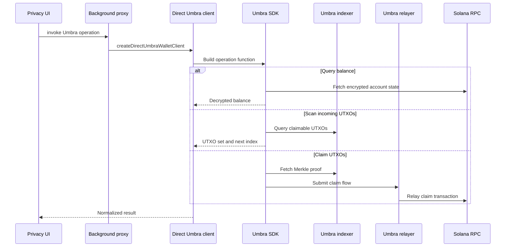

Umbra is the privacy protocol used by Vaulkyrie's Privacy Vault mode. Vaulkyrie integrates the Umbra SDK rather than reimplementing the protocol.

The project uses Umbra for confidential registration, encrypted balances, public-to-private deposits, private-to-public withdrawals, receiver-claimable UTXOs, UTXO scanning, and relayer-assisted claims.

## Umbra concepts used by Vaulkyrie

| Concept | How Vaulkyrie uses it |
| --- | --- |
| User registration | `registerConfidential` registers confidential and anonymous account state. |
| Master seed | Stored or derived so the wallet can derive viewing keys and decrypt balance state. |
| Encrypted balance | Queried through `getEncryptedBalanceQuerierFunction`. |
| Public deposit | Implemented through `getPublicBalanceToEncryptedBalanceDirectDepositorFunction`. |
| Direct withdraw | Implemented through `getEncryptedBalanceToPublicBalanceDirectWithdrawerFunction`. |
| Receiver UTXO creation | Implemented from encrypted balance or public balance. |
| UTXO scanning | Uses the Umbra indexer endpoint and claim scanner. |
| UTXO claiming | Uses batch Merkle proofs, ZK prover, and Umbra relayer. |

## Vaulkyrie wrapper

`src/services/umbra/umbraClient.ts` exposes a stable wallet-facing interface:

```ts
export interface UmbraWalletClient {
  registerConfidential: () => Promise<string[]>;
  queryAccountState: (address?: string) => Promise<UmbraRegistrationState>;
  queryBalances: (tokens?: UmbraTokenConfig[]) => Promise<UmbraTokenBalanceRecord[]>;
  deposit: (params: UmbraTransferParams) => Promise<DepositResult>;
  withdraw: (params: UmbraTransferParams) => Promise<WithdrawResult>;
  privateSendFromEncryptedBalance: (params: UmbraPrivateSendParams) => Promise<CreateUtxoFromEncryptedBalanceResult>;
  privateSendFromPublicBalance: (params: UmbraPrivateSendParams) => Promise<CreateUtxoFromPublicBalanceResult>;
  scanIncomingUtxos: (startIndex?: number) => Promise<UmbraIncomingUtxos>;
  claimIncomingToEncryptedBalance: (utxos: readonly ScannedUtxoData[]) => Promise<ClaimUtxoIntoEncryptedBalanceResult>;
}
```

## Operation flow



## Network configuration

`src/services/umbra/umbraConfig.ts` maps Vaulkyrie's network id to Umbra's network id, RPC URL, WebSocket URL, indexer endpoint, relayer endpoint, and token list.

Default endpoints are:

| Network | Indexer | Relayer |
| --- | --- | --- |
| mainnet | `https://utxo-indexer.api.umbraprivacy.com` | `https://relayer.api.umbraprivacy.com` |
| devnet | `https://utxo-indexer.api-devnet.umbraprivacy.com` | `https://relayer.api-devnet.umbraprivacy.com` |

## Primary Umbra references

- Introduction: https://sdk.umbraprivacy.com/introduction
- SDK reference: https://sdk.umbraprivacy.com/reference/overview
- Client reference: https://sdk.umbraprivacy.com/reference/client
- Registration: https://sdk.umbraprivacy.com/reference/registration
- Deposit: https://sdk.umbraprivacy.com/reference/deposit
- Withdraw: https://sdk.umbraprivacy.com/reference/withdraw
- Query: https://sdk.umbraprivacy.com/reference/query
- Mixer: https://sdk.umbraprivacy.com/reference/mixer
- Indexer: https://sdk.umbraprivacy.com/indexer/overview
- Relayer: https://sdk.umbraprivacy.com/relayer/overview

