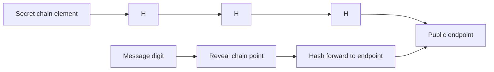
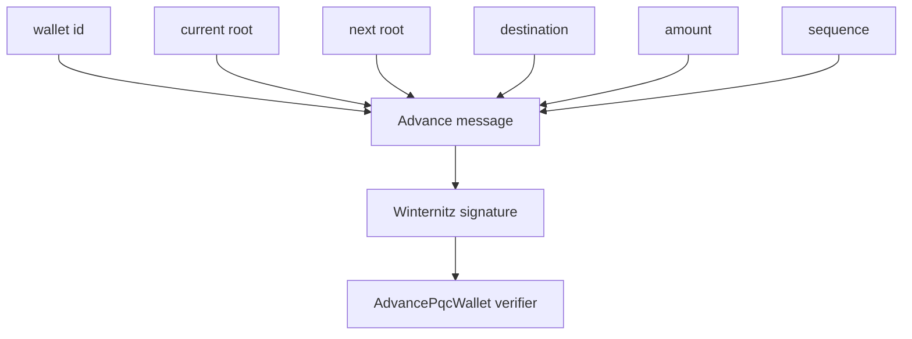

Winternitz one-time signatures are hash-based signatures. A secret key contains many secret chain elements. A public key contains the endpoints of those hash chains. To sign a message digest, the signer reveals an intermediate point in each chain. The verifier hashes those revealed points forward to the public endpoints.

The important constraint is in the name: one-time. Reusing a Winternitz key across messages can leak enough information to forge.

## Basic model

## Vaulkyrie formats

Vaulkyrie contains two compatible code paths because the project evolved from a smaller browser WOTS implementation to the current Solana Winternitz format.

| Format | Chains | Element size | Signature size | Hashing | Source |
| --- | ---: | ---: | ---: | --- | --- |
| Legacy browser WOTS | 16 | 32 bytes | 512 bytes | SHA-256 chain hashing | `src/services/quantum/wots.ts` |
| Solana Winternitz | 32 | 28 bytes | 896 bytes | Keccak-derived 28-byte elements | `src/services/quantum/wots.ts` |

The program and SDK accept either 512-byte legacy signatures or 896-byte Solana Winternitz signatures in the current instruction builders. New PQC Wallet flows should use the 896-byte Solana Winternitz format.

## Message binding

The PQC wallet advance message binds:

- Wallet id
- Current root
- Next root
- Destination pubkey
- Amount
- Sequence

The TypeScript builder is `pqcWalletAdvanceMessage` in `src/services/quantum/wots.ts`. The Rust mirror is `pqc_wallet_advance_message` in `crates/vaulkyrie-protocol/src/lib.rs`.

## Root advancement

Vaulkyrie stores a current signing root in `PqcWalletState`. A spend proves knowledge of the one-time key for that root and supplies a next root. If accepted, the program advances state to the next root and increments sequence.

This design makes reuse visible: after a successful spend, the old root should no longer be valid for future spends.

## Blueshift credit

Vaulkyrie's PQC direction is inspired by Blueshift Labs' Solana Winternitz work. The Vaulkyrie implementation is its own code path, but the core idea of making a Solana-compatible Winternitz authorization flow is credited to that work.

Primary Blueshift references:

- Winternitz Signatures on Solana: https://learn.blueshift.gg/en/courses/winternitz-signatures-on-solana
- Winternitz Signatures with Pinocchio: https://learn.blueshift.gg/en/courses/winternitz-signatures-on-solana/winternitz-signatures-with-pinocchio
- Pinocchio Quantum Vault challenge: https://learn.blueshift.gg/en/challenges/pinocchio-quantum-vault

## Source references

- `src/services/quantum/wots.ts`
- `src/background/quantumVaultSession.ts`
- `src/sdk/instructions.ts`
- `crates/vaulkyrie-protocol/src/lib.rs`
- `crates/vaulkyrie-sdk/src/instruction.rs`
- `programs/vaulkyrie-core/src/instruction.rs`
- `programs/vaulkyrie-core/src/processor.rs`
