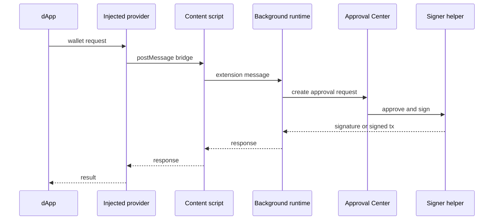

The browser extension is the main Vaulkyrie user experience. It is a Vite React app with extension background, content, and injected-provider runtimes.

## Runtime files

| Runtime | Source |
| --- | --- |
| React entry | `src/main.tsx` |
| App shell | `src/App.tsx` |
| Background runtime | `src/background/index.ts` |
| Content script | `src/content/index.ts` |
| Injected provider | `src/injected/index.ts` |
| Extension messages | `src/extension/messages.ts` |
| Approval preview/storage | `src/extension/approvalPreview.ts`, `src/extension/approvalStorage.ts` |

## Account kinds

The wallet supports multiple account modes through shared wallet state and account helpers:

- Threshold Vault
- Privacy Vault
- PQC Wallet

Signing selection happens through account-kind checks in `src/services/frost/signTransaction.ts`.

## Signing entry points

| Function | Source | Use |
| --- | --- | --- |
| `signMessageBytes` | `src/services/frost/signTransaction.ts` | Signs arbitrary message bytes with Threshold Vault or Privacy Vault path. |
| `signSerializedTransaction` | `src/services/frost/signTransaction.ts` | Signs serialized legacy or versioned Solana transactions. |
| `signAndSendTransaction` | `src/services/frost/signTransaction.ts` | Signs and submits a legacy transaction. |
| `signAndSendVersionedTransaction` | `src/services/frost/signTransaction.ts` | Signs and submits a versioned transaction. |
| `prepareQuantumVaultAdvanceInBackground` | `src/background/quantumVaultSession.ts` | Prepares a PQC wallet advance signature and next key record. |

## Approval flow



## Wallet state

Wallet state is managed in `src/store/walletStore.ts` and persisted through `src/lib/walletPersistStorage.ts`. Backup and restore helpers live in `src/lib/walletBackup.ts`.

Secret access is mediated by background session helpers:

- `src/background/sessionState.ts`
- `src/background/vaultSession.ts`
- `src/background/quantumVaultSession.ts`

## Build scripts

```bash
npm install
npm run build
npm run lint
```

