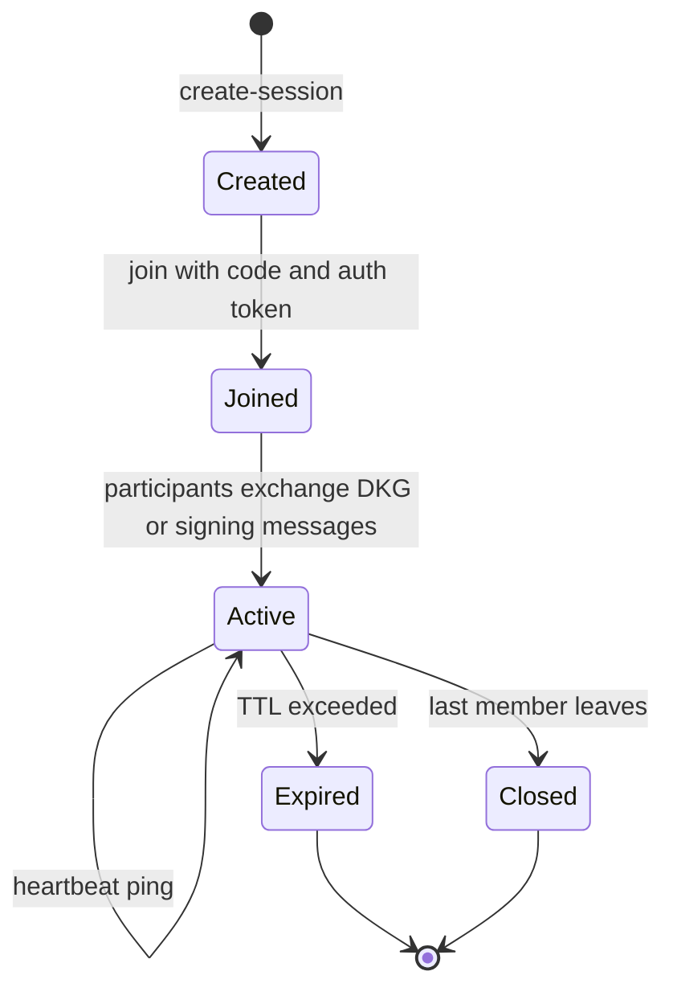
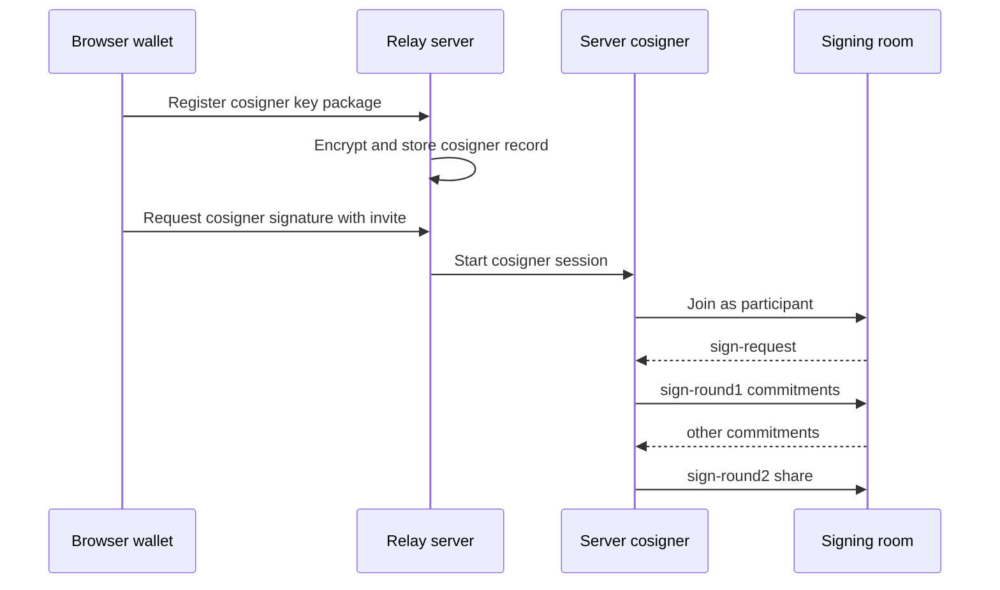

The relay server is a private Node.js TypeScript package under `relay-server/`.

It has three responsibilities:

- Coordinate cross-device DKG and signing sessions.
- Store and operate an optional server cosigner share.
- Sponsor PQC wallet initialization when configured.

## Server files

| Source | Responsibility |
| --- | --- |
| `relay-server/src/server.ts` | HTTP server, WebSocket server, session lifecycle, CORS, health/status endpoints, cosigner and sponsor endpoints. |
| `relay-server/src/cosigner.ts` | Register cosigner share, report safe status, join signing sessions, produce signature shares. |
| `relay-server/src/frost.ts` | Load FROST WASM for server-side cosigner signing. |
| `relay-server/src/secureStorage.ts` | Encrypted JSON state storage and legacy state migration. |
| `relay-server/src/pqcSponsor.ts` | PQC wallet init sponsorship, payer keypair loading, RPC submission, usage limits. |

## WebSocket session lifecycle



## Important defaults

| Setting | Source constant |
| --- | --- |
| Default port | `PORT`, default `8765` |
| Session TTL | `SESSION_TTL_MS`, 10 minutes |
| Max sessions | `MAX_SESSIONS`, 100 |
| Max participants per session | `MAX_PARTICIPANTS_PER_SESSION`, 10 |
| Member stale window | `MEMBER_STALE_MS`, 45 seconds |

## Server cosigner flow



## Environment variables

| Variable | Purpose |
| --- | --- |
| `PORT` | Relay HTTP/WebSocket port. |
| `COSIGNER_STORE_PATH` | Optional path for encrypted cosigner records. |
| `VAULKYRIE_RELAY_SECRET` | Secret material for encrypted relay state. |
| `PQC_SPONSOR_STORE_PATH` | Optional path for PQC sponsor usage records. |
| `PQC_SPONSOR_KEYPAIR_PATH` | Optional sponsor payer keypair path. |
| `PQC_SPONSOR_FREE_LIMIT` | Free sponsorship limit. |
| `PQC_SPONSOR_TOKEN` | Token required for sponsor endpoints when configured. |

## Build scripts

```bash
cd relay-server
npm install
npm run build
npm start
```

