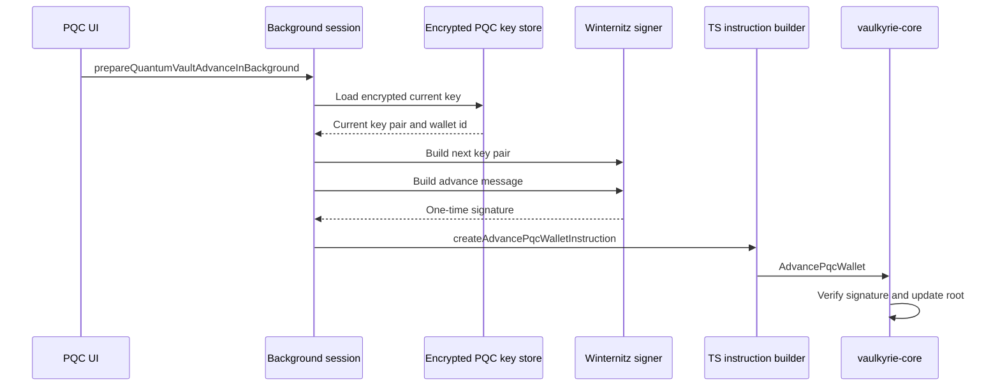

PQC Wallet is Vaulkyrie's post-quantum-oriented wallet mode. It uses hash-based one-time signatures rather than Ed25519 signatures for spend authorization.

The implementation is inspired by Blueshift Labs' Winternitz-based Solana work and adapts the idea into Vaulkyrie's browser wallet and `vaulkyrie-core` program model.

## What it protects against

Classical Solana wallets rely on Ed25519. A sufficiently capable quantum adversary could threaten elliptic-curve signatures. Hash-based one-time signatures are a different family of signatures whose security rests on hash preimage resistance.

PQC Wallet does not make the entire Solana runtime quantum-safe. It creates a wallet-specific authorization path where the spend proof is a one-time Winternitz signature checked against a root stored by the program.

## Two formats in the code

The browser code currently supports two WOTS formats:

| Format | Signature bytes | Source | Status |
| --- | ---: | --- | --- |
| Legacy browser WOTS | 512 | `src/services/quantum/wots.ts` | Supported for backwards compatibility. |
| Solana Winternitz | 896 | `src/services/quantum/wots.ts`, `src/sdk/instructions.ts`, `crates/vaulkyrie-sdk/src/instruction.rs`, `programs/vaulkyrie-core/src/instruction.rs` | Current on-chain-compatible format. |

The current Solana format uses:

- 32 chains
- 28-byte chain elements
- 256 chain steps
- Keccak-derived chain hashing
- 896-byte signatures

## Spend flow

Each spend consumes the current one-time signing key and advances the wallet to a next root.



## Source map

| Concern | Source |
| --- | --- |
| Key generation, derivation, signing, verification | `src/services/quantum/wots.ts` |
| Encrypted PQC key storage and migration | `src/services/quantum/quantumVaultStorage.ts` |
| Background signing session | `src/background/quantumVaultSession.ts` |
| UI | `src/pages/QuantumVault.tsx` |
| TS instruction builder | `src/sdk/instructions.ts` |
| Rust instruction builder | `crates/vaulkyrie-sdk/src/instruction.rs` |
| Shared protocol constants | `crates/vaulkyrie-protocol/src/lib.rs` |
| Program verification and state update | `programs/vaulkyrie-core/src/processor.rs` |

## Example: derive a phrase-backed PQC key

```ts
import {
  deriveSolanaWinternitzKeyPairFromMnemonic,
  generatePqcMnemonic,
} from "@/services/quantum/wots";

const mnemonic = generatePqcMnemonic();
const keyPair = await deriveSolanaWinternitzKeyPairFromMnemonic(mnemonic, {
  wallet: 0,
  parent: 0,
  child: 0,
});
```

## Example: build the on-chain advance message

```ts
import { PublicKey } from "@solana/web3.js";
import { pqcWalletAdvanceMessage } from "@/services/quantum/wots";

const message = await pqcWalletAdvanceMessage(
  walletId,
  currentRoot,
  nextRoot,
  new PublicKey(destinationAddress).toBytes(),
  BigInt(amountLamports),
  BigInt(sequence),
);
```

## Example: build an advance instruction

```ts
import { PublicKey } from "@solana/web3.js";
import { createAdvancePqcWalletInstruction } from "@/sdk";

const ix = createAdvancePqcWalletInstruction(
  new PublicKey(pqcWalletPda),
  new PublicKey(destinationAddress),
  {
    signature,
    nextRoot,
    amount: BigInt(amountLamports),
  },
);
```

## Operational warning

<Warning>
Winternitz keys are one-time keys. Do not sign multiple messages with the same current key. In Vaulkyrie, a successful PQC spend must move from `currentRoot` to `nextRoot`.
</Warning>

