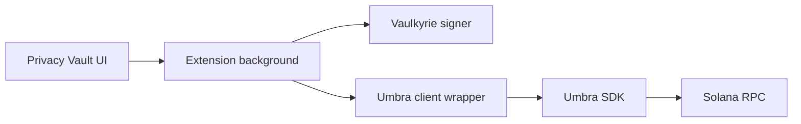

Privacy Vault is Vaulkyrie's privacy-focused wallet mode. It gives users a Vaulkyrie-native wallet surface for private transfer workflows while relying on Umbra for the underlying privacy protocol.

<Note>
For detailed Umbra protocol behavior, read Umbra's official documentation at https://sdk.umbraprivacy.com/introduction.
</Note>

## What users can do

Privacy Vault is designed for users who want a wallet mode for:

- Registering a confidential account.
- Viewing encrypted balance state.
- Moving funds into and out of private balance workflows.
- Creating private transfer flows.
- Scanning and claiming incoming private transfers.

## How it fits into Vaulkyrie

## Source map

| Concern | Source |
| --- | --- |
| Privacy UI | `src/components/wallet/PrivacyView.tsx` |
| Privacy onboarding | `src/components/onboarding/PrivacyVaultSetup.tsx` |
| Umbra wrapper | `src/services/umbra/umbraClient.ts` |
| Network and token config | `src/services/umbra/umbraConfig.ts` |
| Master seed storage | `src/services/umbra/umbraMasterSeedStorage.ts` |
| Vaulkyrie signer adapter | `src/services/umbra/vaulkyrieUmbraSigner.ts` |

## Current readiness

Privacy Vault is implemented for testing and review. It should not be treated as audited production privacy infrastructure yet.
