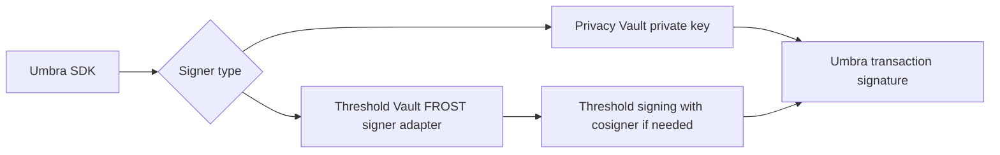

Privacy Vault is Vaulkyrie's privacy-focused wallet mode. It uses a locally stored Ed25519 signer for wallet authorization and Umbra for confidential registration, encrypted balances, private sends, scanning, and claiming.

## What Privacy Vault adds

Normal Solana transfers expose sender, receiver, token, and amount on-chain. Umbra changes the user workflow by introducing encrypted balance state and claimable UTXOs. Vaulkyrie wraps the Umbra SDK so a Privacy Vault can:

- Register a confidential and anonymous Umbra account.
- Query encrypted balances for configured tokens.
- Deposit public balance into encrypted balance.
- Withdraw encrypted balance to a public address.
- Create private sends from public balance or encrypted balance.
- Scan incoming claimable UTXOs.
- Claim incoming UTXOs into encrypted balance.

## Source map

| Concern | Source |
| --- | --- |
| Umbra client wrapper | `src/services/umbra/umbraClient.ts` |
| Network and token config | `src/services/umbra/umbraConfig.ts` |
| Master seed storage | `src/services/umbra/umbraMasterSeedStorage.ts` |
| Threshold signer adapter for Umbra | `src/services/umbra/vaulkyrieUmbraSigner.ts` |
| Wrapped SOL helpers | `src/services/umbra/wrappedSol.ts` |
| Privacy UI | `src/components/wallet/PrivacyView.tsx` |
| Privacy onboarding | `src/components/onboarding/PrivacyVaultSetup.tsx` |
| Background key loading | `src/background/vaultSession.ts` |

## Client construction

`createUmbraWalletClient` returns a background proxy when called from the UI and a direct Umbra client when called in the background context.

```ts
import { createUmbraWalletClient, parseUiAmount } from "@/services/umbra/umbraClient";

const client = await createUmbraWalletClient(walletPublicKey, "devnet");
const amountAtomic = parseUiAmount("0.25", 9);
```

In background mode, the direct client builds Umbra dependencies from:

- `getUmbraClient`
- `getUserRegistrationFunction`
- `getEncryptedBalanceQuerierFunction`
- `getPublicBalanceToEncryptedBalanceDirectDepositorFunction`
- `getEncryptedBalanceToPublicBalanceDirectWithdrawerFunction`
- `getEncryptedBalanceToReceiverClaimableUtxoCreatorFunction`
- `getPublicBalanceToReceiverClaimableUtxoCreatorFunction`
- `getClaimableUtxoScannerFunction`
- `getReceiverClaimableUtxoToEncryptedBalanceClaimerFunction`

## Signing model

Privacy Vault accounts use direct private-key signing. Threshold Vault accounts use `createVaulkyrieUmbraSigner`, which adapts Vaulkyrie's FROST signer into Umbra's signer interface.



## Master seed handling

Umbra needs a master seed for encrypted balance and viewing-key derivation. Vaulkyrie handles this differently by account type:

| Account type | Seed behavior |
| --- | --- |
| Privacy Vault | Tries deterministic seed derivation from the vault signer. If the on-chain Umbra identity already exists, it validates deterministic and stored seeds against the identity. |
| Threshold Vault | Uses background master seed storage because threshold signing cannot always deterministically reproduce a local seed across devices. |

Relevant code:

- `resolvePrivacyVaultSeedState` in `src/services/umbra/umbraClient.ts`
- `resolveThresholdSeedState` in `src/services/umbra/umbraClient.ts`
- `createBackgroundUmbraMasterSeedStorage` in `src/services/umbra/umbraMasterSeedStorage.ts`

## Example: register and query balances

```ts
import { createUmbraWalletClient } from "@/services/umbra/umbraClient";

const client = await createUmbraWalletClient(walletPublicKey, "devnet");

const signatures = await client.registerConfidential();
const state = await client.queryAccountState();
const balances = await client.queryBalances();
```

## Example: private send from encrypted balance

```ts
import { createUmbraWalletClient, parseUiAmount } from "@/services/umbra/umbraClient";

const client = await createUmbraWalletClient(walletPublicKey, "devnet");

await client.privateSendFromEncryptedBalance({
  destinationAddress,
  mint: "So11111111111111111111111111111111111111112",
  amountAtomic: parseUiAmount("0.1", 9),
});
```

## Supported networks and tokens

`src/services/umbra/umbraConfig.ts` currently supports Umbra on mainnet and devnet. The configured token list includes USDC, USDT, wSOL, and UMBRA on mainnet, and wSOL on devnet.

The indexer and relayer endpoints can be overridden with environment variables:

```bash
VITE_UMBRA_INDEXER_URL=
VITE_UMBRA_RELAYER_URL=
```

