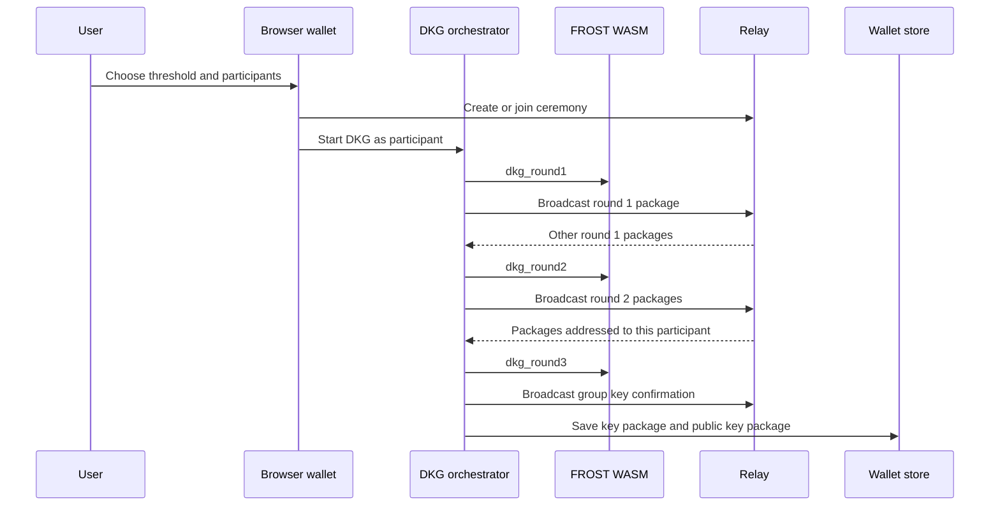
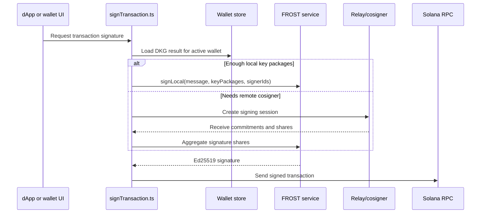

Threshold Vault is Vaulkyrie's MPC wallet mode. Instead of generating one Ed25519 private key and storing it on one machine, Vaulkyrie runs FROST DKG to create participant key packages. A threshold subset of participants can later cooperate to produce a normal Ed25519 signature for Solana.

## User-facing idea

A Threshold Vault is still a Solana wallet from the outside. The difference is how signatures are produced.



## DKG implementation

The browser DKG flow is implemented in:

- `src/services/frost/frostService.ts`
- `src/services/frost/dkgOrchestrator.ts`
- `crates/vaulkyrie-frost-wasm/src/lib.rs`

`frostService.ts` loads the WASM module lazily and exposes typed wrappers around:

- `dkgRound1`
- `dkgRound2`
- `dkgRound3`
- `signingRound1`
- `signingRound2`
- `aggregateSignature`
- `verifySignature`
- `runLocalDkg`
- `signLocal`

The local demo path simulates all participants in one browser. The multi-device path runs the same round functions but exchanges packages over a relay.

## Signing implementation

Threshold signing is implemented in:

- `src/services/frost/signingOrchestrator.ts`
- `src/services/frost/signTransaction.ts`
- `src/services/frost/cosignerThresholdSigner.ts`

The signing path signs the exact message bytes required by Solana transactions:



## Relay choices

Vaulkyrie has two relay implementations.

| Relay | Source | Notes |
| --- | --- | --- |
| Same-origin tab relay | `src/services/relay/channelRelay.ts` | Uses `BroadcastChannel`. Useful for local testing or multiple tabs. |
| Cross-device relay | `src/services/relay/websocketRelay.ts` and `relay-server/src/server.ts` | Uses WebSocket sessions, invite auth tokens, participant assignment, heartbeat, stale cleanup, and room forwarding. |

## Server cosigner

The relay server can store one cosigner share and join a signing session when requested.

Relevant source:

- `relay-server/src/cosigner.ts`
- `src/services/cosigner/cosignerClient.ts`
- `src/services/frost/cosignerThresholdSigner.ts`

Important behavior:

- `registerCosignerShare` validates and stores a cosigner key package.
- `getCosignerStatus` returns metadata without exposing the key package.
- `requestCosignerSignature` starts a WebSocket signing session for a registered vault.
- `runCosignerSession` joins the relay session, emits signing commitments, and returns a signature share.

## Example: local FROST smoke test

The CLI exposes DKG harness commands from `crates/vaulkyrie-cli/src/cmd/dkg.rs`.

```bash
cargo run -p vaulkyrie-cli -- dkg sign --message 68656c6c6f
```

Custom threshold example:

```bash
cargo run -p vaulkyrie-cli -- dkg sign-custom \
  --message 68656c6c6f \
  --min-signers 2 \
  --max-signers 3 \
  --signers 1,3
```

These commands prove the Rust FROST harness works. They do not create a hosted, production-ready custody service by themselves.

## Example: browser signing call site

The browser signing helper selects Threshold Vault or Privacy Vault based on the active account kind.

```ts
import { signMessageBytes } from "@/services/frost/signTransaction";

const signature = await signMessageBytes(walletPublicKey, messageBytes);
```

For Threshold Vault accounts, this calls the FROST path. For Privacy Vault accounts, it delegates to the local Privacy Vault signer.

